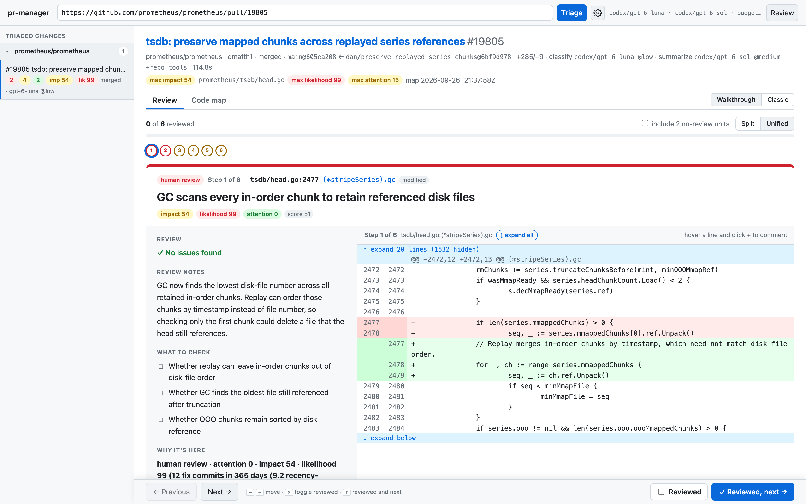
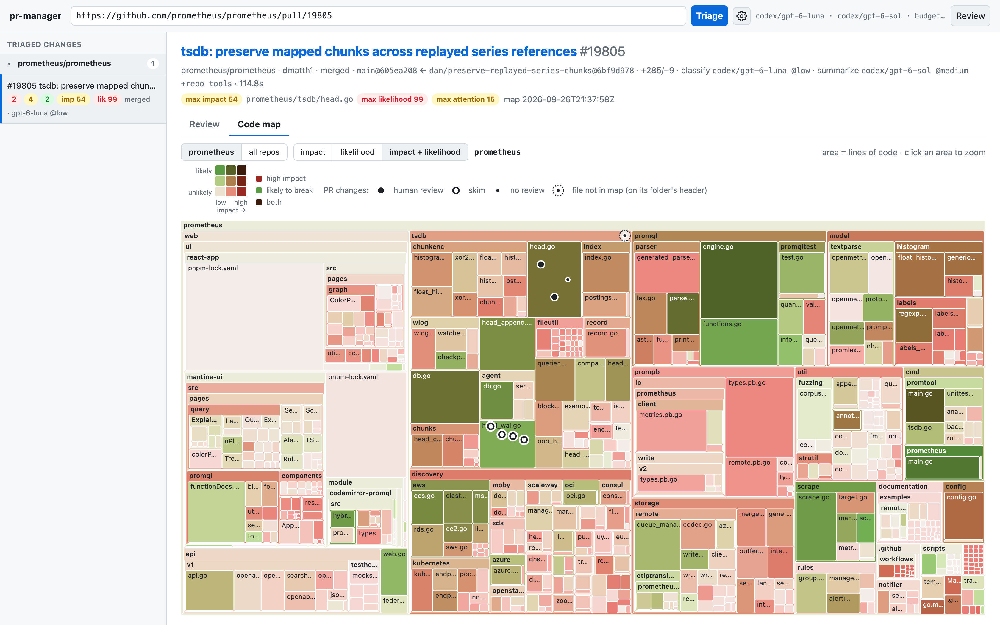

# pr-manager

PR Manager helps you review and fix code changes with a guided walkthrough and a code map. In **Pre-PR** mode, open your repository directory to review changes since your branch diverged from `origin/main` or the remote's default branch, including unpushed commits and uncommitted edits. Add `#` and a commit or branch to the path to review that instead, as committed: `~/src/app#a82c38` is the one commit against its parent, and `~/src/app#feature` is the branch from where it left the default branch. The branch button next to the input lists the checkout's branches and recent commits to pick from. **Create PR** works only on the checked-out branch. Fixing such a review asks first: **Check out and fix** switches the checkout to the branch (a commit gets a new `pr-manager/<sha>` branch at it; the working tree has to be clean) and fixes there, and **Fix current code** keeps the checkout's branch and has the fixer find the reviewed code in it as it is now, skipping issues that no longer apply. In **On-PR** mode, paste a PR link to review the changes, fix issues, and approve the PR.

Reviewing [prometheus/prometheus#19805](https://github.com/prometheus/prometheus/pull/19805),
a TSDB fix that preserves mapped chunks during WAL replay.

Review walkthrough with the review notes and code diff side by side:



Code map with the PR's changes marked on the files they touch:



## Install the desktop app

macOS Apple silicon, with [Homebrew](https://brew.sh):

```sh
brew tap amitbet/pr-manager https://github.com/amitbet/pr-manager
brew install --cask amitbet/pr-manager/pr-manager-desktop
```

Open **PR Manager** from Applications. The app includes its own icon.

Windows amd64, with [Scoop](https://scoop.sh):

```powershell
scoop bucket add pr-manager https://github.com/amitbet/pr-manager
scoop install pr-manager-desktop
```

Open **PR Manager** from the Start menu. Scoop creates the shortcut with the app icon.

Linux amd64, download and extract the desktop app:

```sh
curl -fLO https://github.com/amitbet/pr-manager/releases/latest/download/pr-manager-linux-amd64.tar.gz
tar -xzf pr-manager-linux-amd64.tar.gz
```

Run `./pr-manager-linux-amd64`. The app has a window icon; the archive does not
install an application-menu shortcut. It requires GTK 3 and WebKit2GTK 4.1.

## Update the desktop app

macOS:

```sh
brew update
brew upgrade --cask amitbet/pr-manager/pr-manager-desktop
```

Windows:

```powershell
scoop update
scoop update pr-manager-desktop
```

Linux: close the app and repeat the two download and extract commands above
in the same directory to replace the executable.

Before opening the app for the first time, run `gh auth login`. On Linux,
install `git` and `gh` first. See [installation details](#installation) for
the CLI and other builds.

## About

Sorts a branch's diff into three buckets:

- **human**: someone has to read it
- **skim**: skim the generated summary
- **none**: can't change behavior (generated, formatting, pure rename, comment-only)

Every uncertain case moves up a bucket. A failed LLM call, an invalid answer, low confidence, a truncated diff, or a review that finds a real issue all push the unit up. Nothing reaches "none" without a stated reason.

Requires Go, git and an authenticated [gh](https://cli.github.com) (`gh auth login`). Keep gh current (`brew upgrade gh`): older releases reject some `gh pr view --json` fields.

## Pipeline

1. **Diff**: `git diff -M base...head`, plus a `-w --ignore-blank-lines` pass to find formatting-only files.
2. **Units**: Go hunks are split at top-level declarations using `go/parser`, so each function or type is one unit. TS/JS hunks are split at top-level declarations, and Java, Python, C#, Rust, shell, PowerShell, C, C++, PHP, Scala, Kotlin, Ruby, Swift and Dart hunks at the innermost type, method, property, function or impl (`codemap/decls`, tree-sitter grammars), so a field change is a unit of its class. Other files are one unit each.
3. **Presort** (`triage/presort.go`) handles the deterministic rules. `force_human` paths always go to human. Lockfiles, `*.pb.go`, mocks, `linguist-generated` files and files with a `Code generated ... DO NOT EDIT` header go to none. So do pure renames and whitespace-only files. Docs go to skim.
4. **Lint** (`triage/lint.go`): the static analysis the repository is already set up for, run over the lines the PR adds. A tool runs only when the repo has its config (`ruff.toml` or `.ruff.toml`, or a `pyproject.toml` with a `[tool.ruff]` section) and the binary is installed, so findings come with the project's own rules; `shellcheck` runs on changed shell scripts, which needs no config. `eslint` and `golangci-lint` configs can run code (a JS config, a plugin), and the config is the PR's, so those two run only when the operator names them (`-lint eslint,golangci-lint`), never under auto or from `lint:` in `.triage.yaml`, which the PR itself can change. A built-in credential scan needs nothing installed and runs whenever linting is on: AWS keys, private key blocks, GitHub, Slack, Stripe and npm tokens, signed JWTs, and credentials written into the source, with placeholders (`changeme`, `${VAULT_KEY}`, `your-secret-here`) filtered out. Findings anywhere but on an added line are dropped: they belong to the repository, not to the change. What is left goes three places — into the review prompt as facts the reviewer is told **not** to repeat (so it spends its tokens on what a linter cannot see), into the unit's likelihood as a `lint` factor, and onto the Issues tab on its own, where it can be dismissed. Each tool gets its own timeout and its failures are warnings, so a missing or slow linter never fails a triage. `-lint auto|off|golangci-lint,eslint,ruff,shellcheck`, or `lint:` in `.triage.yaml`.

5. **Impact** (`triage/impact.go`): each unit is looked up in the code map by name, never by the map's stored line numbers. The unit's changed lines are resolved to names on the PR's own merge base: Go declarations (the head-side name first, then base-side names, which covers renames), TS/JS top-level declarations, Java types and methods, Python functions, classes and methods, C# types and members, Rust items, the types, functions and members of the other tree-sitter languages, and OpenAPI `operationId`s, using the indexer's parsers (`codemap/decls`). Context lines don't count, and an insertion only counts when it lands inside a declaration, so a new function is never scored as its neighbour. Anything the map doesn't know falls back to file, directory, then repo. SQL and other files use the file record. The result is a 0-100 impact score that blends CodeRank (how much of the system depends on the code) with rollback difficulty (migrations, persisted formats, CRDs, API tiers, DB/queue/k8s writes).
6. **Likelihood** (`triage/likelihood.go`): how likely the change is to go wrong, 0-100, as a sum of capped points so every score comes with its reasons. From the code map: the file's fix and revert commits in the last year (recency-weighted, half-life 180 days), churn, distinct authors, fixes elsewhere in its directory, and files it usually changes with that the PR leaves out. From the change: the cyclomatic complexity and nesting of the declarations it touches at head, and how much it adds over the merge base (`codemap/cx`), whether the PR's author has changed this file or much of the repo in two years (`git log` on the PR clone, `codemap/githist`), a code change with no test changed next to it, how many directories the PR spans, changed lines (a weak signal), whether the PR is itself a fix, and what static analysis reported on the added lines (step 4). Rule-skipped units and test files score 0. The signals come from just-in-time defect prediction (Kamei et al.), Meta's diff risk score and Prime Video's diff-aware features. Points are tuned under `likelihood:` in the code-map config (`codemap/indexer/default.yaml`, overridden with `-codemap-config`).
7. **Classify** (only with `-summarizer off`): with a reviewer, step 8 places every unit it reads and this step is skipped, since a separate small-model call would only add a second, weaker opinion. Without one, a forced tool call, validated in Go, with confidence thresholds from the policy. Classification only reads the units' diffs, so it starts right after the presort and runs while the repository is checked out, linted and mapped (steps 4–6). A fix classifies only once its rounds are done, and units whose diff the fix did not change keep their earlier decision.
   **Batching**: up to `classify_batch.max_units` (6) units in file order share one `submit_triage_batch` call, up to `classify_batch.max_chars` (16000) of diff; a bigger unit is classified alone. Each unit sits under its own `## Unit U<n>` heading and gets its own decision. A unit the answer leaves out or gets wrong, and every unit of a call that fails, is classified again on its own. On a subscription CLI most of a classify call is starting the process, so this cuts the stage roughly by the batch size once a PR has more units than `-j`. On the eval fixtures at `-j 2` it halved the stage (52s → 25s on `codex`) with every labeled unit still right. Batched answers lean slightly toward "skim" on borderline helpers: `isErrorReply` in the inventory fixture, which solo calls also split on. `-classify-batch 1`, `classify_batch.max_units: 1` or unchecking Settings → *Batch classify* goes back to one call per unit.
   **Kept decisions**: decisions are stored under `-cache` (`decisions/`), keyed by the prompt version, the classifier, its model and effort, the thresholds, and the unit's file, declaration and diff. A unit that did not change is not classified again on the next run, whether that is a push, a forced re-run or another PR with the same change. The list of the PR's other units is not part of the key, so adding a unit does not re-classify the rest. Failed classifications are never kept. `-classify-cache=false` turns it off; eval never uses it.
8. **Analyze**: one call of the stronger model per unit (or per group, below) triages it, describes it and reviews it for defects. It returns the bucket, change kind, risk signals, confidence and reason (the same rules and thresholds the classifier uses), a headline and summary, what to check for human units, and issues. A rule's bucket (`force_human`, docs) stands; the review only adds notes and issues to it. A failed call or an answer without a valid bucket leaves the unit in human with no confidence, which pins it there. Besides the unit's diff and the code-map context (dependent repos, rollback reasons, top likelihood factors), the prompt carries the rest of the PR (`triage/prcontext.go`): the other units' diffs, up to `review_context_chars` (default 32000), ordered with code moved from them first, then units that name each other (callers and callees), then the same file. It also carries notes worked out in Go: "this declaration does not exist at the merge base", and "N added lines here were removed from unit X", which means the code moved and its behavior is not new. Every issue has to come with `evidence` (the quoted line), a `failure_scenario`, `introduced_by_pr` and `depends_on_unseen_code`, and the rules are enforced when the answer is decoded, not left to the prompt. A claim that depends on code the reviewer did not see becomes an "unverified:" item under *what to check*. A problem the PR did not introduce, or one without a failure scenario, is capped at low, and the claimed severity is kept (`claimed_severity`, `capped`). A separate critic call then checks each remaining issue against the change and assigns its severity. Invalid issues are removed. If the critic fails or gives an invalid answer, the issue stays.
   **Grouping** (`triage/group.go`): by default related units share one review call instead of getting one each. Units are merged when they name each other (caller and callee), when a changed test is named after the production symbol it exercises, or when two small changes sit in the same file. Merging is greedy from the strongest link down and stops at `grouping.max_chars` (12000) and `grouping.max_members` (8), so a large unit stays on its own. Each member is placed on its own merits. The reply carries one entry per unit, so every unit still gets its own headline, summary, what-to-check list and issues; a unit the reply leaves out is reviewed on its own rather than going unreviewed. Both caps come from a sweep over five public Go, Java and TypeScript PRs (`experiments/grouping-tuning`): at the default it cut review calls 72% and input tokens 69% across 217 units, with every unit still reviewed and no reply dropping a member. The member cap matters because merging is single-linkage, so a chain of pairwise links can pull 20+ units into one review; the uncapped arms reported 0 and 1 high-severity issues where the capped ones reported 3, against 2 for ungrouped review. Grouping is a cost measure, not a recall one (`experiments/hunk-grouping-prometheus-18905/FINDINGS.md`). Turn it off with `-group-review=false` or `grouping.enabled: false`.
   With review tools (`-review-tools`), the `codex` and `claude-code` reviewers can read the repository at the PR head: a detached `git worktree` of the head commit (removed after the run), or the fixture's `head_dir`. Go repos also get the module cache (`go env GOMODCACHE`), so a claim about a library's behavior can be checked against its source. Claude Code gets `Read,Grep,Glob` only; Codex stays in its read-only sandbox. It's on by default. It makes the review slower, so turn it off with `-review-tools=false` or in the UI's Settings. Without a git checkout, the review runs without tools. The API providers ignore it.
   Summaries, review notes and issue text are written in English. If `-summary-lang` (e.g. `Hebrew`, `Japanese`) or the UI's Settings → *Summary language* picks another language, the finished text is translated in the background as soon as the triage ends, so a PR opens in that language with the English one click away (EN). A result triaged before, or whose translation failed, is translated when the PR is opened. The translation is cached next to the result under `results/translations`. English is never translated. Changing language doesn't re-run the triage. The translator is `-translator`/`-translate-model`/`-translate-effort` or Settings → *Summary language*; by default it is the reviewer's provider with its fastest model: `gpt-5.6-luna` at minimal effort on codex, `claude-sonnet-5-5` at low on claude-code (on a cached PR, 27s against 60s for Sonnet 5 and several minutes for Haiku through the CLI), and the small classify model elsewhere. A translation is cached regardless of model, so a new translator applies to PRs not yet translated. Code identifiers, paths and quoted evidence stay as they are.
9. **Tiers** (`triage/tiers.go`): each unit gets one score. Before review it is the *prior*: √(impact × likelihood), times a change-kind weight (behavior and config 1, test 0.8, refactor 0.6, rename 0.5, docs/format/generated 0.3; at least 0.8 when the analysis said human, at most 0.3 when it said none; with a reviewer the prior is worked out once the review has placed the unit). A review that found nothing lowers the score by the review budget's *trust*; only low issues earn half of that. The score never drops below the review's attention (low 15, medium 45, high 75, critical 95, plus 5 per extra issue). The budget's cut-offs then pick the bucket. Some units are *pinned* to human whatever the budget: `force_human` and binary rules, failed or unsure classifications, impact ≥ `critical_impact` (85), a medium-or-worse issue, and a failed review. Other rule decisions keep their bucket. Without a code-map impact, a unit keeps the classifier's bucket unless the review raises it. Behavior changes, units with risk signals, units the classifier sent to human and truncated diffs never go below skim, unless the budget sets `lift_floors` (less and least) and the review found nothing. Every unit a rule did not skip gets an LLM review, so a low budget never cuts review coverage. Inside a bucket, units are ordered by score. Every unit's `score.why` shows the arithmetic, e.g. `score 41 = 58 × 0.7 (clean review) → human (≥ 40 on balanced)`. An issue a person dismissed stops counting everywhere in this step (see *Dismissing what the review got wrong*).

   The **review budget** has five steps, from the most human review to the least:

   | budget | trust | human ≥ | skim ≥ | clean review lifts floors |
   | --- | --- | --- | --- | --- |
   | most | 0 | 30 | 10 | no |
   | more | 0.15 | 35 | 12 | no |
   | balanced (default) | 0.3 | 40 | 15 | no |
   | less | 0.45 | 45 | 18 | yes |
   | least | 0.6 | 50 | 20 | yes |

   Set it with `tiers.review_budget` in `.triage.yaml` or `-review-budget`. Override single steps under `tiers.budgets`, and weights under `tiers.kind_weights`. Results store their scores, so the UI's budget slider re-buckets a PR without re-running it. Results cached before scores existed are re-scored when they load, with their stored bucket standing in for the classifier's call.
10. **Render**: markdown (human, then skim, then collapsed none) or JSON.

In the UI, each review issue has a **Fix issue** button, and the review toolbar has **Fix all issues**. They work on open PRs and local repositories; a merged or closed PR (as of its triage) has them disabled. While a fix runs, the result stays open with a banner showing the fix stage, and **View log** opens the job's activity log in a dialog (clicking the fix in the sidebar's Running list does the same). The fixed result opens when the job finishes. By default, fixes are applied to a persistent local worktree under the app cache, on a branch created at the exact PR head commit. Settings can instead apply fixes directly in the cached local clone. That option checks out the PR head branch there and stops if the clone already has local changes. The PR's head branch name is used when available; a local `pr-manager/pr-N-...` branch is used if that name is already taken. Each round applies a patch and then checks it: the check reviews the issue's unit and units touched by the patch, and asks whether each targeted comment was addressed. The check skips classification, static analysis and the code map. Settings can keep fixing issues these checks find; recursion is on by default and stops after three rounds unless you change the limit. Once the rounds end, the fixed code is triaged once: units the fix changed are classified, everything is linted and scored, and the checks' reviews are kept, so nothing is reviewed twice. If a later round fails, the fix keeps the rounds that worked, re-triages them and warns in the fix banner. The new result shows the branch and checkout path.

### Existing review comments

On a GitHub PR, triage also loads the open review threads left on the PR and puts each one on the unit its line falls in. Resolved and outdated threads are skipped. Threads started by someone with write access, by the PR author, or by an app installed on the repo are checked by the review model like its own issues. The check sorts each comment into a defect, a change request, a question, or a nit, decides whether the claim holds, and restates confirmed ones with our own severity. It never deletes a comment. One it can't confirm stays listed as "not confirmed" with the reason. A comment that repeats an issue the review already found is linked to that issue, and the issue shows "raised by @someone" instead of a draft button.

Threads from anyone else are shown but never sent to a model automatically, because their text could try to steer the fixer. GitHub reports org members who hide their membership as contributors, so on public repos some maintainers land here. Each thread has **Fix comment** (confirmed) or **Fix anyway** (the rest). The arrow next to **Fix all issues** chooses whether confirmed comments go along; they do by default. After each fix round, the model checks every targeted comment against the fixed code. Addressed ones are marked fixed, and the rest go into the next round. Triaging the same PR head again reuses the cached result and only reloads the threads, checking just the new or edited ones. A confirmed comment counts toward the unit's attention like a review issue, unless it repeats one, and a medium-or-worse one pins the unit to human review under any budget. It stops counting once it is resolved on GitHub or fixed. Replies on GitHub are left to you, since fixes stay on a local branch until you push them.

### Reviewing again after a push

Re-triaging a PR after a push used to cost what the first triage cost, even when the author changed one file. A run now keeps the review an earlier run of the same PR earned, for every unit that did not move (`triage/incremental.go`, `incremental.go`).

A unit keeps its review when **its own diff is unchanged and so is everything it was judged against**. The second half is the part that matters. The review prompt carries the rest of the PR precisely so a defect visible only across two units can be found — a caller that limits the problem, a test that shows the intent, code that moved in from somewhere else — so a unit is reviewed again when any of these changed, even though its own lines did not:

- another change in the same file,
- a unit it names, or that names it (callers and callees),
- a unit code moved between, in either direction, before or after the push. A unit reviewed as "this code moved here from X, so its behavior is not new" is reviewed again once X stops showing those lines as removed,
- a unit the push dropped: code judged against it was judged against something that no longer exists.

Generated and formatting units never cost anything its review, because they are never shown to a reviewer in the first place.

Everything else still runs on the whole diff — units, presort, lint, impact, likelihood and scoring are cheap, and a carried unit keeps the bucket its review gave — so the buckets are as fresh as a full run's, and a carried unit is placed from this run's prior and its kept issues, not from the bucket it had before. Open review comments are carried too: a comment whose text has not changed keeps its verdict instead of being sent to the model again, and a comment's "same as review issue N" link is dropped where the unit was reviewed again, since those issues were just rewritten.

Four things carry nothing, because they change what every unit was judged against rather than any one unit's lines: a different merge base (a rebase or a base-branch merge), different models or review settings, a rebuilt code map, and `-force`, which asks for a re-run and so gets a real one. The first is checked against the previous run's `base_oid`; the rest are the settings hash in the result's cache key, and only a run with the same one is looked at.

The result records what it kept (`carried`), and the UI says so above the tabs: *Incremental: 12 of 20 reviewed units kept from `a1b2c3d4`, 8 reviewed again*. Each carried unit gets a **kept from** chip, and the job log says why every other unit lost its review. `-incremental=false` turns it off; the same switch is in Settings.

The same applies to a local checkout in Pre-PR mode: a commit or a save changes a few units and leaves the rest alone.

### The Issues tab, and dismissing what the review got wrong

The **Issues** tab puts every claim anyone has made about the PR in one list, sorted worst first: the review's own issues, the static-analysis findings from step 4, and the open review comments from GitHub. Each row says where it came from and links to the change unit it is about.

A review issue or a lint finding can be **dismissed**. Nothing is deleted: the claim, its evidence and the reason it was rejected all stay on the record, and it stops counting. The unit's attention drops to what is still standing, a review left with nothing earns its clean-review discount back, and the pin a medium-or-worse issue put on the unit lifts, so the unit falls to wherever its score puts it. A pin from a failed review is not something anyone dismissed, and stays. Restoring puts the unit back exactly where the review left it. Likelihood is not touched: it was measured when the PR was triaged, and the finding was real when it was measured.

Dismissals are kept per repository, not per PR, under `dismissed/<host>__<owner>__<repo>.json` in the app cache, and applied whenever a result is loaded. So a claim rejected once arrives dismissed after the next push, without re-running the triage. Each record keeps the unit, the quoted evidence, the severity, the reason, and a `pattern`: the significant words of the title, sorted. An issue is matched on the code it quotes rather than the model's wording, so a reworded claim on the same line is still the same claim. `pattern` is written but not matched on yet; it is what a reviewer that learns from its own record will read.

A GitHub comment has no **Dismiss**: it belongs to whoever wrote it, and resolving the thread on GitHub is what makes it stop counting.

### The Sequence tab

The **Sequence** tab draws the call flow the PR changes: the request or job its changes sit on, as participants and steps. The model returns the shape — participants, steps, which steps this PR changed and which change unit is responsible — and the drawing is done here, so a reply that names a participant it never declared produces a smaller diagram rather than a broken one. A changed step that names a unit is a button: clicking it opens that change in the Review tab. The **Before / After** switch (After by default) shows the flow as the PR leaves it or as it was before: the model marks each step as added, removed or unchanged, and an altered step comes in both forms, so either side is the same list filtered, with no second call. Before highlights the steps the PR removes or replaces. **Copy as Mermaid** gives the side on screen as text, for a PR description. A diagram saved before the switch existed is drawn again the next time the tab is opened.

A triage starts writing it in the background as soon as the result is saved, so the triage itself does not wait for it; opening a result that has none (an older one, or one whose call failed) starts it then, before the tab is opened. It is saved with the result. The call runs at low reasoning effort at most, whatever the review effort: it redraws what the units already say, and on an 11-unit PR medium effort doubled its time (58s against 27-33s) for no better a diagram. A PR with no single flow (a docs change, a formatting pass, unrelated edits) says so instead of inventing one.

## Installation

The release build is one executable with the UI, code-map indexer and default
scoring config embedded. Homebrew packages for macOS, a Scoop bucket for Windows,
and macOS/Linux/Windows release archives are configured. See [installation and release setup](docs/install.md)
for runtime dependencies, direct downloads and release setup.

For the Wails desktop build with cgo tree-sitter and native builds for macOS
arm64, Linux amd64 and Windows amd64, see [desktop build](docs/desktop.md).

With Homebrew (the tap lives in this repository):

```sh
brew tap amitbet/pr-manager https://github.com/amitbet/pr-manager
gh auth login
```

The desktop app (macOS, Apple silicon) opens the UI in its own window, so
there's no server to start:

```sh
brew install --cask amitbet/pr-manager/pr-manager-desktop
open -a "PR Manager"
```

It installs `PR Manager.app` into `/Applications`, pulls in `gh` and `git`, and
removes quarantine, since the app is ad-hoc signed and not notarized.

The CLI (macOS and Linux) runs the same UI in your browser, plus the triage,
`prs` and `index` commands:

```sh
brew install --cask amitbet/pr-manager/pr-manager
pr-manager serve
```

On Windows, with [Scoop](https://scoop.sh) (the bucket also lives in this repository):

```powershell
scoop bucket add pr-manager https://github.com/amitbet/pr-manager
scoop install pr-manager-desktop    # or pr-manager for the CLI
gh auth login
```

## Usage

```sh
go build -o pr-manager .

# default: a logged-in Codex (ChatGPT) or Claude Code subscription on this machine
./pr-manager -C ../some-repo -base origin/main

# Claude Code subscription: Opus 5.5 triages and reviews (Haiku 4.5 translates)
./pr-manager -classifier claude-code -summarizer claude-code

# Claude API key: same models
ANTHROPIC_API_KEY=... ./pr-manager -classifier anthropic -summarizer anthropic

# OpenAI
./pr-manager -classifier openai-api -summarizer openai-api

# fully local
./pr-manager -classifier ollama -classify-model qwen3.5:9b -summarizer ollama -summary-model qwen3.5:9b

# classify only, no review: OpenJev first pass, units it isn't sure about go to Claude
./pr-manager -summarizer off -classifier openjev -fallback claude-api

# presort only, no LLM
./pr-manager -classifier off -summarizer off

# review everything again instead of keeping what did not change since the last run
./pr-manager -incremental=false

# write the PR description / gate a script
./pr-manager -o triage.md && gh pr create --body-file triage.md
./pr-manager -fail-on-human      # exit 2 if anything needs a human
./pr-manager -out json -o triage.json
```

Policy: copy `triage.example.yaml` to `<repo>/.triage.yaml`.

`-codemap DIR` (default the user cache directory plus `pr-manager/codemap`, `off` to disable) picks the code map. PR runs use the GitHub repo name as the map repo. Local `-C` runs use the checkout's directory name, or `-map-repo`.

## Code map

The code map is a CodeRank + rollback-difficulty index of your repos, built by `pr-manager index` / `pr-manager codemap` or the development wrapper `cmd/codemap`. See [codemap/README.md](codemap/README.md) for the metrics and file format.

For development, `make codemap` indexes a workspace (a directory containing `code/<repo>`) into `.cache/map`:

```sh
make codemap WORKSPACE=~/ws                  # refresh (re-extracts only repos that changed)
make codemap WORKSPACE=~/ws MAP_REPO=api     # force one repo
make codemap-rank CODEMAP_CONFIG=my.yaml     # re-score after editing a scoring config
make codemap-lookup TARGET='api/internal/user/server.go:(*Server).GetProfile'
```

`WORKSPACE` defaults to `PR_MANAGER_WORKSPACE`.

### Indexing your own repos

The map is built from two sources, set with flags, environment variables or the UI's Settings → *Code map*:

- **Local code directory** (`-code-root DIR`, `PR_MANAGER_CODE_ROOT`): the git checkouts in `DIR/<repo>` or `DIR/<org>/<repo>` are symlinked into the workspace and indexed as they are on disk, uncommitted changes included. A checkout is named by its `origin` remote, so a repo cloned into a different directory name still matches its PRs.
- **Org** (`-org`, `PR_MANAGER_ORG`): a GitHub or GitHub Enterprise org or user, as `acme`, `ghe.example.com/platform` or its URL. Every repo you can see, except archived repos and forks, is cloned (blobless) under the cache's `workspace/code`. A repo in the local directory is linked instead of cloned.

```sh
pr-manager index -org acme                       # clone and index every repo of acme
pr-manager index -code-root ~/code               # index the checkouts under ~/code
pr-manager index -org acme -code-root ~/code     # both: local checkouts, clones for the rest
```

`index` pulls the clones it already has, and only re-extracts repos that changed. In the UI, **Index now** does the same and shows how many repos were linked, cloned, updated or failed. A PR from a repo that isn't in the map is added when it is triaged: linked from the local directory if it's there, else cloned. Cross-repo impact (which repos depend on the changed code) only counts repos that are in the map, so index the whole org.

A rebuilt map changes the result cache key, but already-triaged PRs are not re-run. The UI and `prs` reuse the newest cached result for the same PR head until you re-run it (`-force`, or confirm the prompt when you press **Triage** in the UI).

## GitHub PRs and the UI

```sh
make ui                     # chooses a free port on 127.0.0.1 and opens the browser
make triage-prs REPO=acme/api AUTHOR=someone LIMIT=10   # triage an author's PRs into the UI cache
./pr-manager -pr https://github.com/acme/api/pull/566   # one PR, in the terminal
```

Paste a PR link (`.../pull/N`, `.../pull/N/files` or `owner/repo#N`) or a local Git checkout path into the UI to triage it. Local triage compares the checkout with the merge base of `origin/HEAD` (or `origin/main` / `origin/master`) and shows how many commits it is ahead and behind. It includes committed, staged, unstaged and untracked changes in the same hunk review. It uses a temporary Git index, so the checkout's index is untouched. A local result supports review notes, code context, walkthrough, code map and fixes. Fixes use a separate worktree at the checkout's current commit, so committing what was triaged doesn't need another triage. If the code, branch or merge base changed since triage, the fix still runs on the current code, with a warning in the fix banner and on the fixed result that the review is of the triaged code. If the checkout has uncommitted changes when a fix starts, the UI asks whether to commit them (with a message the summarizer writes) and fix in a worktree, or apply the fix in the current branch next to them. **Don't ask again** saves the answer, and Settings → Fix issues changes it.

The local result has a **Create PR** button. Commit any working tree changes and triage again before clicking it. The button pushes the current branch to `origin` and runs `gh pr create --fill`. If the commits are on the default branch, it creates and switches to a `pr-manager/<commit>` branch first. Pending review notes are copied to the new PR. The button checks that the branch and diff still match the triaged result.

**GitHub Enterprise.** Links on any host work, so GitHub Enterprise Server (`https://ghe.example.com/org/repo/pull/7`) and GitHub Enterprise Cloud with data residency (`*.ghe.com`) PRs triage the same way, as long as `gh` is logged in to that host (`gh auth login --hostname ghe.example.com`). `owner/repo#N` uses `GH_HOST` when it is set, else github.com; `host/owner/repo#N` names the host. `prs -repo` takes `host/owner/repo`. Clones, cached results and drafts for Enterprise hosts are kept under the host name, so the same owner/repo on two hosts don't collide; github.com keeps the names it had. Every unit shows its bucket, impact, likelihood, review attention, reason, confidence, summary, score and any escalations, above its hunks. The unit's details show how the score picked its bucket. **details** lists the issues the review found (with a **→ draft comment** button when the line can take a GitHub comment) the code-map entry (matched symbol/file, CodeRank, rollback tags, dependent repos and top callers) and the likelihood factors with the measurements behind them. The PR header shows the highest impact, likelihood and attention.

The **Code map** tab is a treemap of the PR's repo (or **all repos**): repo → directories → files, sized by lines of code and colored by **impact** (red), **likelihood** (green) or **impact + likelihood**, the default: the two ramps blend like overlapping inks, so red is high impact, green is likely to break, and the darkest cells (brightest in dark mode) are both. A 3×3 legend shows the combinations. The green is lighter and yellower than the red at every step, so red-green colorblind readers can still tell them apart. A directory's likelihood is its 75th-percentile file. The PR's units are dots in the file they touch, at their line: filled = human review, ring = skim, small = no review. Hovering a dot shows its impact (matched map entry, CodeRank, callers, dependent repos, rollback tags) and its top likelihood factors. Hovering an area shows both scores, its commits, fixes, reverts and authors in the last year, and its worst function's complexity. Click an area to zoom in (breadcrumb to zoom out), or click a dot to open that unit in the Review tab: its walkthrough step (a "no review" unit ticks the box that includes them), or its place in the classic list. A table of all changes sits under the map, sorted by risk (click a header to sort by impact, likelihood, bucket or file). `?tab=map` opens the tab directly. The tree comes from `GET /api/codemap/tree?repo=<name|all>`. Diffs for "none" units start collapsed.

The gear button in the header opens **Settings**: the provider and model for each run (separately for the classifier and the summarizer), the review budget slider (More ↔ Less, with this PR's bucket counts at each step) and review tools. The line next to the gear shows the models and budget in use. It only lists providers this machine can run: Codex or Claude Code logged in with a subscription, an API key that is set (`OPENAI_API_KEY`, `ANTHROPIC_API_KEY`), a cloud account (Bedrock, Vertex AI, Foundry, Azure OpenAI, see below), a running Ollama, or OpenJev (classifier only). Hover a provider picker to see why the others are missing. Each provider has its own model list, taken from the provider where it can be read: `codex app-server` `model/list` (as t3code does), the OpenAI and Anthropic `/v1/models` endpoints, and Ollama's `/api/tags`. Claude Code has no list command, so it uses a built-in list. "custom model id…" takes any id. Each role's default is a list, best first, not a single id (`classifyDefaults`, `summaryDefaults`, `translateDefaults` in `main.go`). Where the list is what the endpoint serves (the Anthropic and OpenAI `/v1/models`, including through `ANTHROPIC_BASE_URL`/`OPENAI_BASE_URL` gateways, Ollama, and Azure OpenAI with `AZURE_OPENAI_DEPLOYMENTS`), the default is the first entry the endpoint has, else its newest model of the same family (a gateway with only `claude-sonnet-4-5` gets that for a Sonnet default), else its first model. Codex's list follows the codex profile and leaves out models it runs, and the other providers have built-in lists, so they keep the first entry. Lists are cached for 5 minutes (`GET /api/providers?refresh=1` re-probes), and the picks are remembered in the browser.

The **Review** tab has two modes, switched at the right of the tab bar and remembered: **Walkthrough**, the default, and **Classic**, every file and unit in one list. The walkthrough shows one step at a time, most important first: human review before skim, then by review attention, then by risk (impact × likelihood). By default a step is one unit. Under the diff, the changed definitions the step's code uses from other files are listed collapsed, with a link to the step that reviews them, and open to show their diff. Checking Settings → *Walkthrough steps* makes a step one file's changes in file order, ranked and bucketed by its most important unit; a file over 400 changed lines is split between units, which in practice splits large test files. This only changes how the PR is read, applies at once to every result, and is separate from the review grouping in `triage/group.go`, which only saves model calls. The design comes from `experiments/grouping-readability`. "No review" units are left out unless you tick the box. Each step has the headline, and for each unit the issues ordered by severity (**show line** scrolls to the flagged line, which is marked in the diff), the review notes, the "what to check" list and why the unit is in its bucket, next to its diff. Comments and context expansion work the same as in Classic, and **↕ expand all** shows the whole file with other units' changes dimmed. The step bar is fixed to the bottom of the window: **← Previous** / **Next →** (or `←`/`→`) move one step at a time, the **Reviewed** checkbox (or `x`) marks the step, and **✓ Reviewed, next** (or `r`) does both. Click a numbered dot to jump. Progress is saved for each result.

### Reviewing in the UI

- **Split / Unified** toggle in the toolbar. Split is the default, and the choice is remembered.
- **Expand context** like GitHub: "↑ expand" rows above each hunk and "↓ expand below" at the end of a file load 20 lines at a time from the PR's head commit, with old and new line numbers. **↕ expand all** in a file's header opens every gap at once and shows the whole file; click it again to collapse.
- **Review comments**: hover a line and click **+**. Comments are saved as pending drafts in `.cache/drafts/`, so a reload or restart doesn't lose them. **Review** in the header submits every draft as one GitHub review (Comment, Approve or Request changes) with `gh api repos/{owner}/{repo}/pulls/{n}/reviews`, pinned to the triaged head commit, then clears the drafts. The **+** only appears on lines GitHub accepts: changed lines, and context within 3 lines of a change. Expanded lines can't be commented on. `make ui SERVE_FLAGS=-review-dry-run` shows the payload instead of posting it.

Installed commands store data in the [user cache directory](docs/install.md#data-and-code-maps); the `.cache` paths below describe the Makefile development defaults.

How a PR is fetched: `gh pr view` resolves it, then a blobless clone under `.cache/repos/` fetches `refs/pull/N/head`. The diff runs against the fork point. For merged PRs that's the base branch just before the merge commit, so the diff matches what the PR changed, and source files are parsed at the PR head. `.triage.yaml` and `.gitattributes` are read from the PR head. Results are cached in `.cache/results/`, keyed by PR head SHA, providers, models and prompt version. Pressing **Triage** on a PR that is already cached at its current head asks whether to run it again. Cancel opens the saved result. On the command line, `-force` skips the cache.

With `-classifier auto` (the default) the first available provider wins:

1. `codex`: the Codex CLI logged in with ChatGPT (`codex login`). gpt-6-luna classifies, gpt-6-sol summarizes and reviews.
2. `claude-code`: the Claude Code CLI logged in with a Claude plan (`claude auth login`). Haiku 4.5 classifies, Opus 5.5 summarizes and reviews.
3. `openai-api`: `OPENAI_API_KEY`. gpt-5.4-mini classifies, gpt-6-sol summarizes and reviews.
3. A cloud account this machine is set up for, the way Claude Code is: `bedrock` (`CLAUDE_CODE_USE_BEDROCK=1` or `AWS_BEARER_TOKEN_BEDROCK`), `vertex` (`CLAUDE_CODE_USE_VERTEX=1` or `ANTHROPIC_VERTEX_PROJECT_ID`), `foundry` (`CLAUDE_CODE_USE_FOUNDRY=1` or `ANTHROPIC_FOUNDRY_RESOURCE`), then `azure-openai` (`AZURE_OPENAI_ENDPOINT`).
4. `openai-api`: `OPENAI_API_KEY`. gpt-5.4-mini classifies, gpt-6-sol summarizes and reviews.
5. `claude-api`: `ANTHROPIC_API_KEY`. Haiku 4.5 classifies, Sonnet 5 summarizes and reviews.
6. Ollama.

The small model only classifies with `-summarizer off`. Otherwise the stronger model places each unit in its review call, and the small one only translates.

### Cloud and gateway providers

For companies that only allow models through their own cloud account or an LLM gateway. Each uses the cloud's standard credentials and the environment variables its SDKs and Claude Code already read. Haiku 4.5 classifies and Sonnet 5 summarizes and reviews, unless a model is picked.

| provider | credentials | settings | models |
| --- | --- | --- | --- |
| `bedrock` | the AWS chain (env keys, profiles and SSO, EKS web identity, instance roles), or a Bedrock API key in `AWS_BEARER_TOKEN_BEDROCK` | `AWS_REGION` (default: the profile's, else us-east-1) | `anthropic.claude-*` ids go to the Messages API on Bedrock (`bedrock-mantle.{region}.api.aws`); any other id, such as an inference-profile ARN, Nova or Llama, goes to the Converse API |
| `vertex` | Google Application Default Credentials (`gcloud auth application-default login`, a service account, workload identity) | `ANTHROPIC_VERTEX_PROJECT_ID` (or `GOOGLE_CLOUD_PROJECT`), `CLOUD_ML_REGION` (default `global`; `us`, `eu` or a region) | `claude-sonnet-5`, `claude-haiku-4-5@20251001`, ... |
| `foundry` | `ANTHROPIC_FOUNDRY_API_KEY`, else Entra ID (`az login`, managed or workload identity, a service principal in env) | `ANTHROPIC_FOUNDRY_RESOURCE` or `ANTHROPIC_FOUNDRY_BASE_URL` | deployment names (default `claude-haiku-4-5`, `claude-sonnet-5`) |
| `azure-openai` | `AZURE_OPENAI_API_KEY`, else Entra ID | `AZURE_OPENAI_ENDPOINT`; `AZURE_OPENAI_DEPLOYMENTS` (comma-separated) fills the model list | deployment names (default `AZURE_OPENAI_CLASSIFY_DEPLOYMENT` / `AZURE_OPENAI_REVIEW_DEPLOYMENT`, else `gpt-5.4-mini` / `gpt-6-sol`) |

Gateways: `OPENAI_BASE_URL` points `openai-api` at any OpenAI-compatible server (LiteLLM, Portkey, vLLM), and `ANTHROPIC_BASE_URL` points `claude-api` at an Anthropic-compatible one, with `ANTHROPIC_AUTH_TOKEN` as a bearer token when the gateway doesn't take `x-api-key`. Settings shows which gateway a provider uses.

Claude Opus 5.5 and Fable 5.1 reject a forced tool call, so on every Claude provider those models get `tool_choice: auto` with an instruction to call the tool. A model the tool doesn't know (a Foundry deployment name, say) is switched the first time the API says so. An answer without the call still fails the unit, as before.

The API providers end in `-api` so they aren't confused with the local assistants (`codex`, `claude-code`) that use a subscription. The old names `openai`, `anthropic` and `claude` still work on the command line and in requests.

The subscription providers run the CLI on the server's machine once per call (`codex exec --output-schema`, `claude -p --json-schema`) in an empty temp directory with no tools, hooks or MCP servers (with review tools on, the review runs in the PR-head worktree with read-only tools instead). API keys are removed from their environment, so a key in `.env` never takes the place of the subscription. Login is checked once per process (`codex login status`, `claude auth status`); a Codex login that uses an API key doesn't count as a subscription. Codex needs a strict schema, so optional fields are sent as nullable and nulls are dropped from the answer.

`make` reads `ANTHROPIC_API_KEY` / `OPENAI_API_KEY` from `ENV_FILE` (default `.env`, git-ignored; copy `.env.example`) when they aren't already exported.

OpenAI reasoning effort is `-classify-effort` (default `low`) and `-review-effort` (default `medium`); `''` uses the model's default and `none` turns reasoning off. Any other effort goes through the Responses API, because gpt-5.6 and gpt-6 models only accept function tools with reasoning there. The output caps (4096 classify, 8192 review) include reasoning tokens. `codex` and `claude-code` take the same flags (`minimal` becomes `low`; Haiku has no effort setting). The Anthropic API ignores them: extended thinking can't be combined with the forced tool call each step uses. The effort is part of the result cache key and shows in the UI next to the model (`openai-api/gpt-6-sol @medium`).

Classify (with `-summarizer off`) runs `-j` calls at a time (default 8), each holding up to `-classify-batch` units (default 6); analyze runs `-review-j` (default 16; `0` uses `-j`). Review calls take much longer, especially with review tools, so the stage gets its own limit. Lower it if the provider starts rate-limiting.

## Eval

```sh
./pr-manager eval -fixtures testdata/eval [-classifier ...] [-judge]
```

Each `testdata/eval/NAME.json` is either a past PR in a local clone (`repo`, `base`, `head`) or a saved diff plus the head versions of the changed files (`diff`, `head_dir`, and optionally `base_dir` with the merge-base versions). `labels` maps unit IDs (`file:Symbol`) or file paths to buckets. The key metric is **MISSES human→none**. Over-escalation is tolerable. The eval also re-places every unit under each review budget and prints the bucket counts, the human-labeled units outside human (`under`), and the units with a `must_find` issue outside human (`defects`). Use those to tune the budget steps.

`findings` scores the review itself, per unit ID or file:

```json
"findings": {"store/client.go": {
  "must_find":     [{"match": "transient\\w* errors?[^.]*cach", "min_severity": "low", "max_severity": "medium"}],
  "must_not_find": [{"match": "pointer"}, {"match": "reconnect", "min_severity": "medium"}]}}
```

`match` is a case-insensitive regexp over an issue's title and detail. A `must_find` rule counts as found when an issue matches at a severity inside its range, and as a severity miss when the only match is outside it. A `must_not_find` rule is broken by a matching issue at `min_severity` (default low) or above, so `{"match": "reconnect", "min_severity": "medium"}` accepts it as a low. The eval prints recall on `must_find`, the false positives, and precision over the issues on labeled keys. `inventory-error-cache` moves a retry loop into a new function and adds a negative cache for failed lookups. It checks that the review flags transient errors being cached like permanent ones, does not claim the value-typed `ReplyError` escapes `errors.As`, and rates the pre-existing reconnect as low at most.

`-judge` asks OpenJev how faithful each generated summary is, and lists the ones scoring below 0.5.

## OpenJev

[OpenJev](https://github.com/lookski/openjev) runs a local model for one forward pass and returns softmax probabilities over fixed answers. It generates no text, so its confidence values are real probabilities, not something the model reports about itself. It is fast and free. It can't reason before it answers, so here it only settles units it is very sure about (`DefaultJevAccept`: human ≥ 0.8, skim ≥ 0.9, none ≥ 0.97 plus p(behavior change) ≤ 0.03). Everything else goes to `-fallback`.

```sh
git clone https://github.com/lookski/openjev && cd openjev && pip install -e .
openjev-easy          # serves http://127.0.0.1:8771 (override with OPENJEV_BASE_URL / -openjev-url)
```

The default model (Qwen3-0.6B) is too small to judge code. Use a larger code model, then run `eval` with `-classifier openjev -fallback off` to see how much it gets right on its own before trusting it.

## Layout

```
main.go          flags; triage, eval, serve, prs commands
serve.go         UI server, job runner, result cache
review.go        draft comments, file content for context expansion, review submission
ui/              the UI, embedded into the binary: index.html, css/ per component, js/ ES modules (no build step;
                 main.js renders the page and routes data-act clicks to each component's `actions`)
llm/             provider adapters for Anthropic, OpenAI, Ollama, Codex and Claude Code, plus Bedrock, Vertex AI, Foundry and Azure OpenAI (cloud.go)
                 (Call only, forced tool choice, per-response usage) + OpenJev client
triage/          diff, units, policy, presort, impact, likelihood, classify, prcontext (rest of the PR for review), summarize,
                 workspace (review tools), tiers, pipeline, render, eval, pr (GitHub fetch)
codemap/         code-map reader and lookup (stdlib only)
cmd/codemap/     standalone development entry point for the bundled indexer
codemap/indexer/ indexer, embedded default rules, language extractors (type-checked Go, tree-sitter Java/Python/C#/Rust and shell/PowerShell/C/C++/PHP/Scala/Kotlin/Ruby/Swift/Dart, lexed TS/JS), PageRank and rollback rules
scripts/         development indexer wrapper and standalone release smoke check
testdata/eval/   labeled fixtures
```

## License

Apache License 2.0. See [LICENSE](LICENSE).
